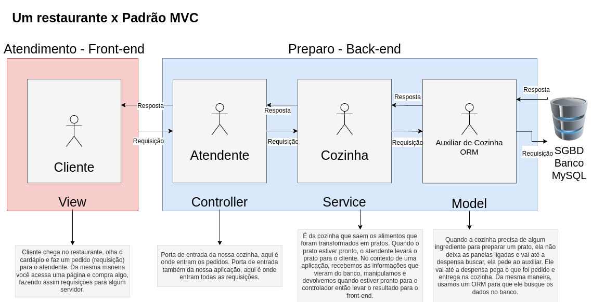

# 2022-06-14

## Sobre

Nessa aula fizemos um paralelo entre o funcionamento de um restaurante e o padrão MVC. Falamos também sobre qual seria a função de um ORM (Object-Relational Mapping) nesse contexto, suas vantagens e tipos de ORMs que existem no mercado. Toda a aula foi resumida no desenho a seguir que foi construído com a turma:

## Status

Concluído ✅
