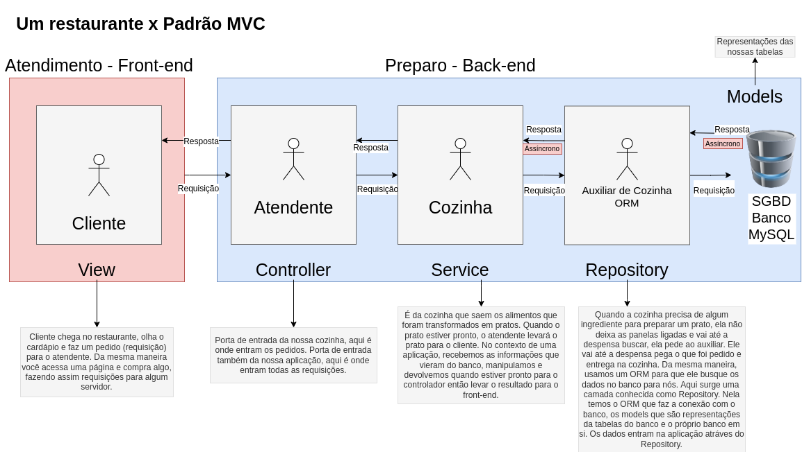

# 2022-06-21

## Sobre

Nessa aula fizemos uma introdução ao ORM [Sequelize](https://sequelize.org/) e iniciamos a configuração de um projeto no diretório [restaurante](./restaurante/). No final da aula falamos sobre assíncronia e atualizamos o desenho do padrão MVC com a camada do Repository:

Links:

- [Documentação do Sequelize](https://sequelize.org/)
- [Beekeeper Studio](https://www.beekeeperstudio.io/)
- [Extensão DotENV](https://marketplace.visualstudio.com/items?itemName=mikestead.dotenv)
- [Gerador de .gitignore Generator](https://marketplace.visualstudio.com/items?itemName=piotrpalarz.vscode-gitignore-generator)
- [Resetar senha do MySQL no Windows](https://medium.com/programadores-ajudando-programadores/como-resetar-senha-no-mysql-8-0-para-windows-a381344b2117)

## Status

Concluído ✅
