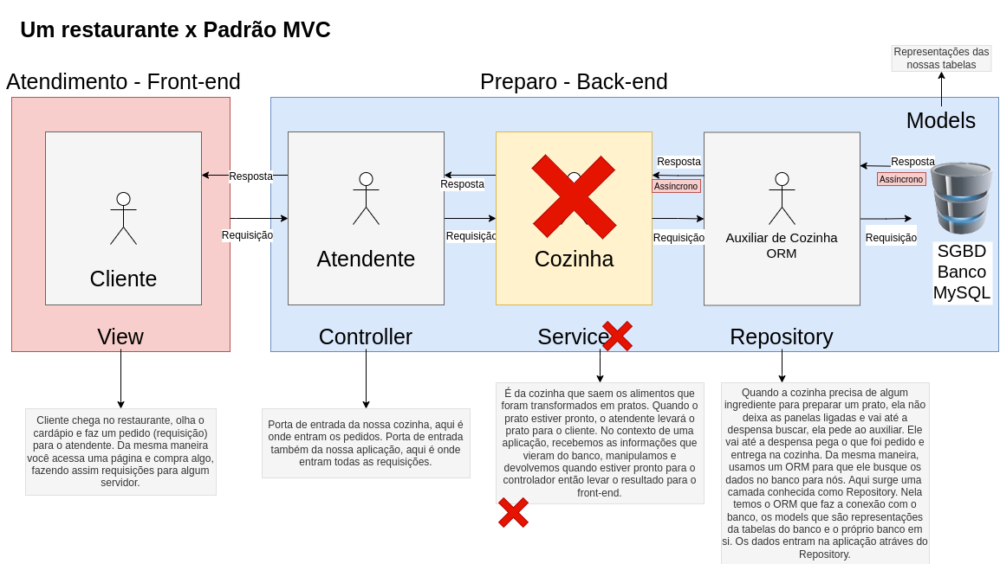
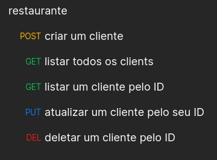

# 2022-06-23

## Sobre

Nessa aula fizemos a continuação da criação de um CRUD de clientes usando o Sequelize. Também usamos o desenho do resumo do padrão MVC e retiramos a parte do Service, para que o mesmo fique compatível com a abordagem que estamos usando no projeto feito em sala.

Por fim adicionamos um [export da collection](./restaurante/restaurante.postman_collection.json) utilizada no [Postman](https://www.postman.com/) para testar a aplicação:

Links:

- [Documentação do Sequelize](https://sequelize.org/)
- [Download do Postman](https://www.postman.com/)
- [Extensão EditorConfig](https://marketplace.visualstudio.com/items?itemName=EditorConfig.EditorConfig)
- [Extensão ESLint](https://marketplace.visualstudio.com/items?itemName=dbaeumer.vscode-eslint)
- [Extensão Prettier](https://marketplace.visualstudio.com/items?itemName=esbenp.prettier-vscode)
- [Extensão SonarLint](https://marketplace.visualstudio.com/items?itemName=SonarSource.sonarlint-vscode)
- [Extensão Trailing Spaces](https://marketplace.visualstudio.com/items?itemName=shardulm94.trailing-spaces)

## Status

Concluído ✅
