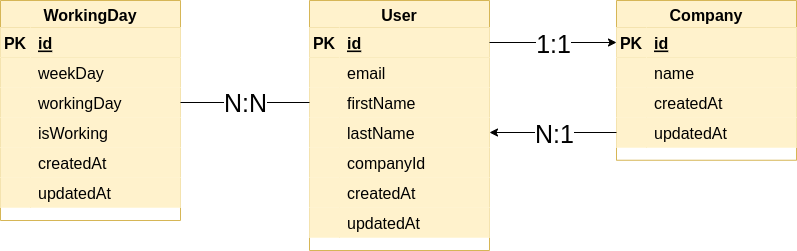
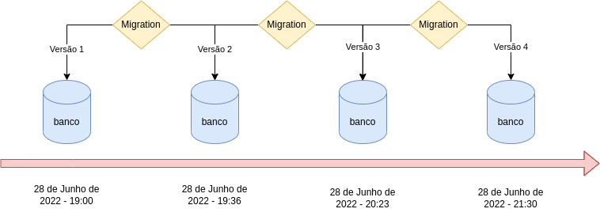

# 2022-06-30

## Sobre

Nessa aula finalizamos a construção de um pequeno projeto para cadastrar e relacionar usuários, empresas e os dias que eles trabalham, conforme o diagrama de entidade e relacionamento a seguir:

Por fim, falamos um pouco sobre como funcionam as migrations:

Links:

- [Documentação sobre Migrations do Sequelize](https://sequelize.org/docs/v6/other-topics/migrations/)

## Status

Concluído ✅
